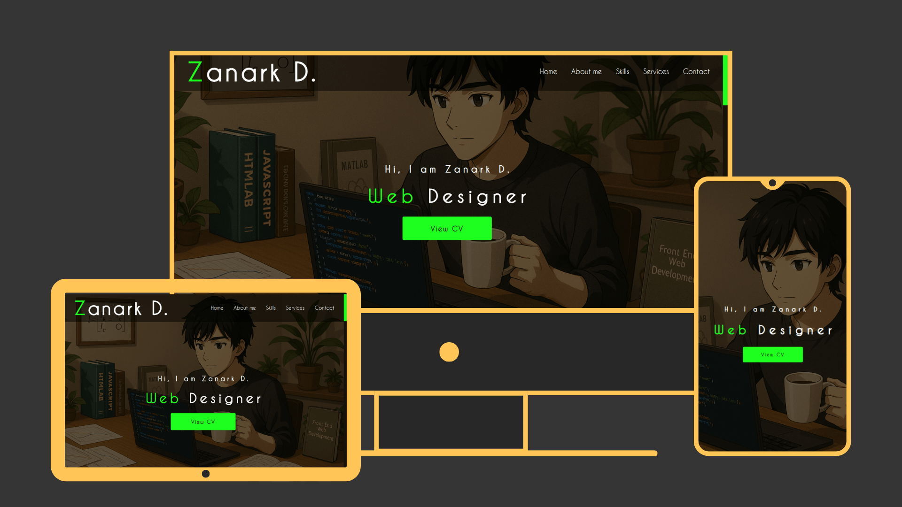

# 🧑‍💼 Custom Portfolio Website

A fully responsive personal portfolio website built with pure HTML, CSS, and JavaScript. Includes smooth animations, modern layout, and elegant section transitions to showcase your work and skills.

## 🌟 Features

- 🖥️ Multi-section layout:
  - Home
  - About Me
  - Services
  - Skills
  - Contact
- ✨ Scroll animations (fade in when section is 30% visible)
- 🎨 Custom scrollbar styling
- 📱 Mobile-first responsive design
- 🧠 Clean code structure and reusability

## 💻 Tech Stack

- HTML  
- CSS  
- Vanilla Javascript

## 🚀 Live Demo

 Try it here 👇👇

 https://zeddy-foreal.github.io/custom-portfolio-website/

## 📸 Preview



## 📁 How to Run Locally

```bash
git clone https://github.com/zeddy-foreal/custom-portfolio-website.git
cd custom-portfolio-website
# Then open index.html in your browser
